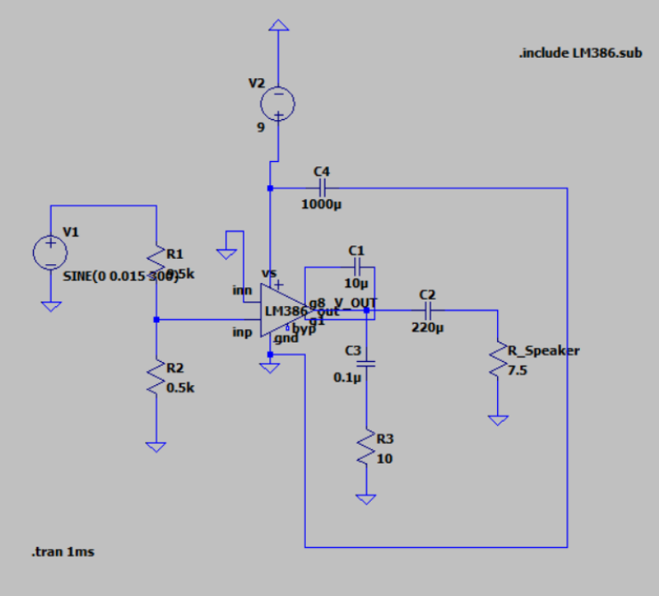

The circuit takes in a signal from an audio jack, that is of a frequency from about 40 Hz to 22 kHz (the range of human hearing). The LM 378 is supplied with 9 volts and the gain is at most 200 times. There is a 10k potentiometer which can modify the gain in a range such that there is no output sound to the point where the sound is 200 times the initial amplitude of the signal.
We chose the values shown below as specified in the LM378 datasheet in order to get a maximum of 200 times gain. We chose a potentiometer to regulate how much of the audio signal we want to pass through. The output is governed by this equation: Vout  = 200*(10k - R) * Vin
The variable resistance was connected to the inverting input so the amount of voltage to the terminal could be changed.

### LTSPice Circuit

### KiCad

